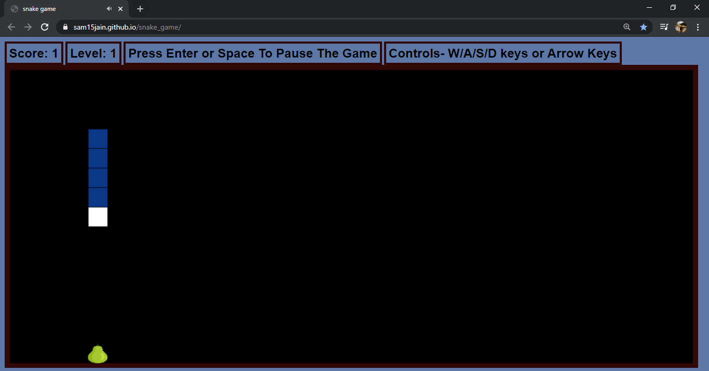
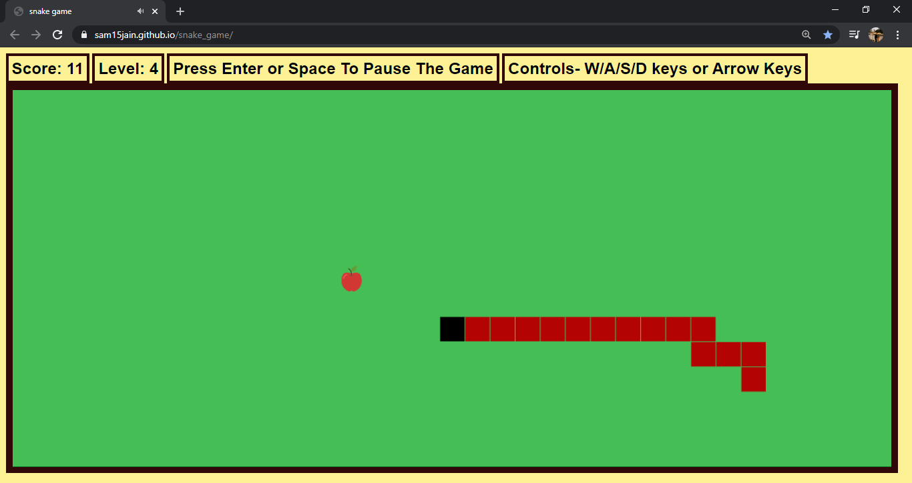
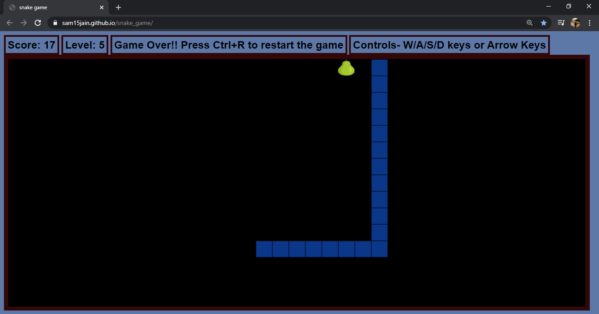
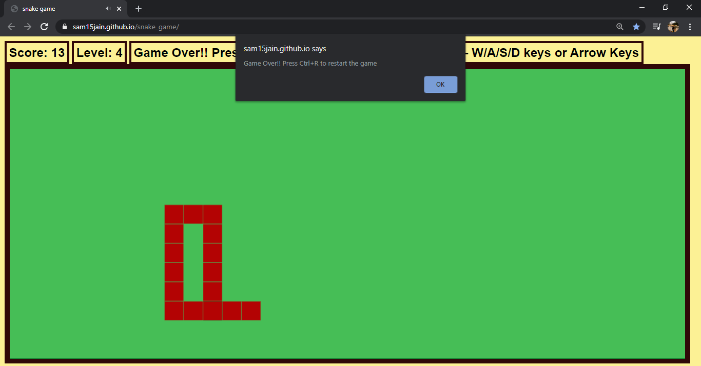
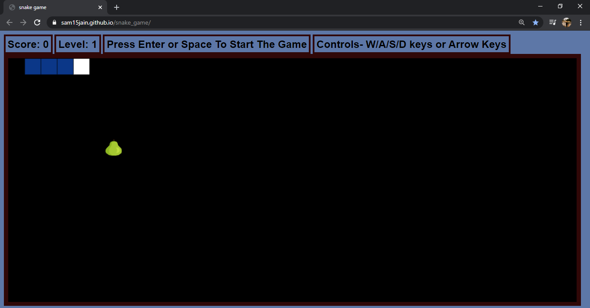
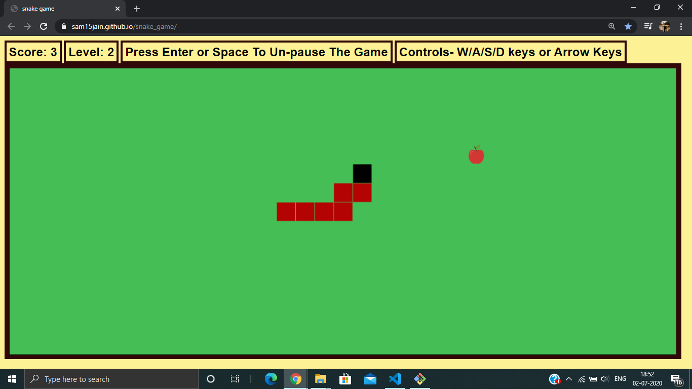

# Snake Game Web App

## About
* Made with JAVASCRIPT , HTML and CSS
* Snake Game for Web.
* Website Link (Desktop Version): https://sam15jain.github.io/snake_game/
## Game Play
 

* The objective of this game is to score points by
making the snake consume food particles which are found at random
positions, while avoiding hitting the walls and itself.

* Length of snake and score increases with each food eaten.

* Level keeps increasing after getting certain scores. 

* With each level up, speed of the snake increases and the colour scheme and images get changed.

* Score and level are updated and displayed dynamically .

* Game gets over when the snake hits a wall, or collides with itself. 

* Sounds and images are included for entertainment, pause and play function is also provided.

## Controls
* W / A / S / D keys or Arrow keys to move the snake
* Space or Enter to Start, Pause or Un-Pause the game

* Ctrl + R to restart the game 
